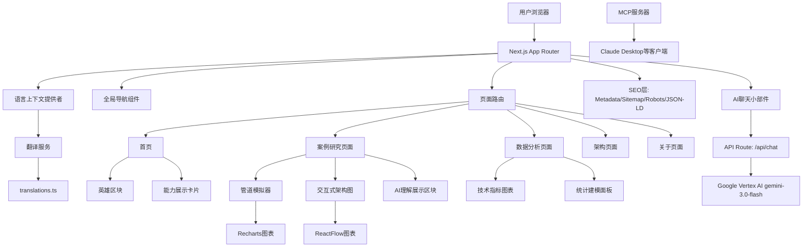

# 设计文档

## 概述

个人作品集网站是一个现代化的双语展示平台，使用Next.js 14构建，旨在展示软件架构师的全栈能力。系统采用组件化架构，支持中英文无缝切换，以InterviewPass项目为核心案例研究，展示产品开发、系统架构和数据工程的综合能力。

核心设计理念：
- **双语优先**: 所有内容支持中英文切换
- **交互式展示**: 通过可视化和模拟展示技术能力
- **响应式设计**: 适配桌面和移动设备
- **暗色美学**: 现代化的视觉设计风格

## 架构

### 系统架构图



### 技术栈

- **前端框架**: Next.js 14 (App Router)
- **样式系统**: Tailwind CSS
- **状态管理**: React Context API (语言管理)
- **图表库**: Recharts (数据可视化)
- **流程图**: ReactFlow (架构图)
- **类型系统**: TypeScript
- **AI后端**: @google-cloud/vertexai (gemini-3.0-flash)
- **MCP**: @modelcontextprotocol/sdk (独立服务器)
- **SEO类型**: schema-dts (JSON-LD类型支持)
- **部署**: Vercel

### 文件结构

```
src/
├── app/
│   ├── layout.tsx              # 根布局 + 全局 Metadata + LanguageProvider
│   ├── page.tsx                # 首页 + JSON-LD Person schema
│   ├── robots.ts               # 动态 robots.txt
│   ├── sitemap.ts              # 动态 sitemap.xml
│   ├── globals.css             # 全局样式 + 暗色主题
│   ├── case-study/
│   │   └── page.tsx            # 案例研究页面
│   ├── data-analysis/
│   │   └── page.tsx            # 数据分析方法论页面
│   ├── architecture/
│   │   └── page.tsx            # 架构页面（占位）
│   ├── about/
│   │   └── page.tsx            # 关于页面（占位）
│   └── api/
│       └── chat/
│           └── route.ts        # Vertex AI 聊天 API
├── components/
│   ├── Navbar.tsx              # 导航栏组件
│   ├── LanguageToggle.tsx      # 语言切换按钮
│   ├── HeroSection.tsx         # 英雄区块
│   ├── CapabilityCards.tsx     # 能力展示卡片
│   ├── PipelineSimulator.tsx   # 管道模拟器
│   ├── InteractiveArch.tsx     # 交互式架构图
│   ├── AiAgentWidget.tsx       # Vertex AI 驱动的聊天组件
│   ├── AiInsightSection.tsx    # AI 理解展示区块
│   ├── DataAnalysisShowcase.tsx    # 数据分析方法论展示
│   ├── TechnicalIndicatorChart.tsx # 技术指标图表
│   └── StatisticalModelPanel.tsx   # 统计建模面板
├── contexts/
│   └── LanguageContext.tsx     # 语言上下文
├── data/
│   ├── translations.ts         # 中英文翻译
│   ├── ai-persona.ts           # AI 助手人设 + 知识库
│   └── synthetic-stock-data.ts # 合成股票数据
└── types/
    └── index.ts                # TypeScript类型定义

mcp-server/                     # 独立MCP服务器包
├── package.json
├── tsconfig.json
├── README.md
└── src/
    ├── index.ts                # MCP 服务器入口
    └── data.ts                 # 作品集数据
```

## 组件和接口

### 语言管理系统

#### LanguageContext.tsx
```typescript
// 语言上下文接口
interface LanguageContextType {
  language: 'zh' | 'en';
  setLanguage: (lang: 'zh' | 'en') => void;
  t: (key: string) => string;
}

// 上下文提供者组件
const LanguageProvider: React.FC<{children: React.ReactNode}>
```

#### translations.ts
```typescript
// 翻译数据结构
interface Translations {
  zh: TranslationContent;
  en: TranslationContent;
}

interface TranslationContent {
  nav: NavigationTranslations;
  hero: HeroTranslations;
  capabilities: CapabilityTranslations;
  caseStudy: CaseStudyTranslations;
  ai: AiTranslations;
}
```

### 导航系统

#### Navbar.tsx
```typescript
interface NavbarProps {
  // 无需额外props，使用语言上下文
}

// 导航项配置
interface NavItem {
  key: string;
  href: string;
  translationKey: string;
}
```

### 首页组件

#### HeroSection.tsx
```typescript
interface HeroSectionProps {
  // 使用语言上下文获取内容
}

// 英雄区块内容结构
interface HeroContent {
  title: string;
  subtitle: string;
  description: string;
}
```

#### CapabilityCards.tsx
```typescript
interface CapabilityCard {
  id: string;
  icon: React.ReactNode;
  titleKey: string;
  descriptionKey: string;
  technologies: string[];
}

interface CapabilityCardsProps {
  cards: CapabilityCard[];
}
```

### 案例研究组件

#### PipelineSimulator.tsx
```typescript
interface SimulationLog {
  timestamp: string;
  level: 'info' | 'success' | 'warning' | 'error';
  message: string;
}

interface ConfidenceData {
  time: number;
  confidence: number;
  stage: string;
}

interface PipelineSimulatorProps {
  logs: SimulationLog[];
  confidenceData: ConfidenceData[];
}
```

#### InteractiveArch.tsx
```typescript
interface ArchNode {
  id: string;
  type: string;
  position: { x: number; y: number };
  data: {
    label: string;
    description: string;
    technologies: string[];
    specs: Record<string, string>;
  };
}

interface ArchEdge {
  id: string;
  source: string;
  target: string;
  animated: boolean;
  label?: string;
}

interface InteractiveArchProps {
  nodes: ArchNode[];
  edges: ArchEdge[];
}
```

### AI聊天小部件

#### AiAgentWidget.tsx
```typescript
// Vertex AI 驱动的聊天组件（替代原iframe方案）
interface AiAgentWidgetProps {
  position: 'bottom-right' | 'bottom-left';
}

interface ChatMessage {
  role: 'user' | 'assistant';
  content: string;
}

interface ChatMode {
  id: 'chat' | 'job-match';
  name: string;
  description: string;
}
```

### AI理解展示区块

#### AiInsightSection.tsx
```typescript
interface AiInsightSectionProps {
  // 使用语言上下文，无需额外props
}
```

### 数据分析展示组件

#### DataAnalysisShowcase.tsx
```typescript
interface DataAnalysisShowcaseProps {
  // 使用语言上下文和内置合成数据
}
```

#### TechnicalIndicatorChart.tsx
```typescript
interface TechnicalIndicatorChartProps {
  data: StockDataPoint[];
  indicators: ('ma' | 'ema' | 'rsi' | 'macd' | 'bollinger')[];
}
```

#### StatisticalModelPanel.tsx
```typescript
interface StatisticalModelPanelProps {
  data: StockDataPoint[];
}
```

### 数据模型（新增）

#### ai-persona.ts
```typescript
interface AiPersona {
  systemPrompt: string;
  portfolio: PortfolioData;
  jobMatchingPrompt: string;
}

interface PortfolioData {
  name: string;
  title: string;
  skills: SkillCategory[];
  projects: Project[];
  experience: Experience[];
}
```

#### synthetic-stock-data.ts
```typescript
interface StockDataPoint {
  date: string;
  open: number;
  high: number;
  low: number;
  close: number;
  volume: number;
}
```

## 数据模型

### 翻译数据模型

```typescript
// 完整的翻译数据结构
const translations: Translations = {
  zh: {
    nav: {
      home: '首页',
      caseStudy: 'InterviewPass案例',
      dataAnalysis: '数据分析',
      architecture: '架构',
      about: '关于',
      logo: 'NiagaraDataAnalyst'
    },
    hero: {
      title: 'AI时代一人军团',
      subtitle: '产品 × 架构 × 数据',
      description: '18年软件架构经验，专注于无服务器架构、AI集成和数据工程'
    },
    capabilities: {
      engineering: {
        title: '工程能力',
        description: '100% 无服务器架构',
        details: 'AWS Lambda, Kinesis视频流'
      },
      ai: {
        title: 'AI与视觉',
        description: 'AI集成与计算机视觉',
        details: 'Amazon Rekognition, LLM集成'
      },
      data: {
        title: '数据循环',
        description: '数据管道与分析',
        details: 'Airbyte, 数据仓库分析'
      }
    },
    caseStudy: {
      title: 'InterviewPass: 技术面试AI助手',
      description: '端到端的技术面试解决方案',
      simulation: {
        title: '实时处理模拟',
        videoProcessing: '视频流处理中...',
        aiAnalysis: 'AI分析进行中...',
        confidenceScore: '置信度分数'
      }
    }
  },
  en: {
    // 对应的英文翻译...
  }
};
```

### 架构节点数据模型

```typescript
// InterviewPass架构节点配置
const architectureNodes: ArchNode[] = [
  {
    id: 'user-client',
    type: 'input',
    position: { x: 0, y: 100 },
    data: {
      label: '用户客户端',
      description: '面试者视频输入界面',
      technologies: ['React', 'WebRTC'],
      specs: {
        '输入格式': 'H.264视频流',
        '分辨率': '1080p',
        '帧率': '30fps'
      }
    }
  },
  {
    id: 'kinesis',
    type: 'default',
    position: { x: 200, y: 100 },
    data: {
      label: 'Kinesis视频流',
      description: '实时视频流处理服务',
      technologies: ['AWS Kinesis Video Streams'],
      specs: {
        '吞吐量': '每秒1000帧',
        '延迟': '<100ms',
        '存储': '7天自动删除'
      }
    }
  }
  // 其他节点...
];
```

### 模拟数据模型

```typescript
// 管道模拟日志数据
const simulationLogs: SimulationLog[] = [
  {
    timestamp: '2024-01-15T10:30:00Z',
    level: 'info',
    message: '开始视频流接收...'
  },
  {
    timestamp: '2024-01-15T10:30:01Z',
    level: 'success',
    message: 'Kinesis流已建立'
  }
  // 更多日志...
];

// 置信度数据
const confidenceData: ConfidenceData[] = [
  { time: 0, confidence: 0.65, stage: '初始分析' },
  { time: 30, confidence: 0.78, stage: '表情识别' },
  { time: 60, confidence: 0.85, stage: '语音分析' },
  { time: 90, confidence: 0.92, stage: '综合评估' }
];
```

## 正确性属性

*属性是应该在系统所有有效执行中保持为真的特征或行为——本质上是关于系统应该做什么的正式陈述。属性作为人类可读规范和机器可验证正确性保证之间的桥梁。*

### 属性1: 语言管理一致性
*对于任何*语言切换操作，系统应该在所有页面和组件中一致地应用选定的语言，并在页面导航中保持语言偏好
**验证: 需求 1.1, 1.2, 1.4**

### 属性2: 翻译数据完整性
*对于任何*翻译键，翻译服务应该为中文和英文都提供有效的内容，且数据结构应该保持一致
**验证: 需求 1.3, 9.3**

### 属性3: 导航系统一致性
*对于任何*页面路由，导航系统应该在所有页面上保持可见和功能正常，且所有导航链接应该正确路由到对应页面
**验证: 需求 2.4, 2.5**

### 属性4: 组件内容渲染
*对于任何*支持双语的组件，当语言上下文改变时，组件应该渲染对应语言的内容且包含所有必需的元素
**验证: 需求 3.1, 5.2, 5.4**

### 属性5: 交互功能响应
*对于任何*可交互元素（架构节点点击、AI小部件展开），用户交互应该触发相应的状态变化和UI更新
**验证: 需求 6.2, 7.2**

### 属性6: 响应式设计适配
*对于任何*视口尺寸变化，所有组件应该保持功能性和可访问性，特别是AI小部件在移动设备上的表现
**验证: 需求 7.4**

### 属性7: 全局组件可用性
*对于任何*页面，全局组件（导航栏、AI小部件）应该始终可访问和功能正常
**验证: 需求 7.5, 8.4**

### 属性8: 技术栈一致性
*对于任何*样式实现，系统应该一致地使用Tailwind CSS类，且所有组件应该正确集成到Next.js App Router架构中
**验证: 需求 8.2, 8.5**

### 属性9: 代码质量标准
*对于任何*代码文件，应该包含中文注释和文档，且翻译内容应该以结构化格式组织，内容与表示逻辑应该清晰分离
**验证: 需求 8.3, 9.1, 9.4**

## 错误处理

### 语言切换错误
- **缺失翻译键**: 当翻译键不存在时，显示键名并记录警告
- **语言加载失败**: 回退到默认语言（中文）
- **状态同步错误**: 重置语言状态到默认值

### 组件渲染错误
- **数据加载失败**: 显示占位符内容和重试选项
- **图表渲染错误**: 显示错误消息和数据表格备选方案
- **交互功能失败**: 禁用交互元素并显示静态内容

### 网络和外部服务错误
- **AI聊天服务不可用**: 显示离线消息和联系信息
- **资源加载失败**: 实现渐进式加载和重试机制
- **路由错误**: 重定向到404页面或首页

### 移动设备兼容性
- **触摸事件处理**: 确保所有交互在触摸设备上正常工作
- **视口适配**: 处理不同屏幕尺寸的布局问题
- **性能优化**: 在低性能设备上降级动画效果

## 测试策略

### 双重测试方法

系统将采用单元测试和基于属性的测试相结合的方法：

**单元测试**:
- 验证特定示例、边缘情况和错误条件
- 测试组件的具体渲染输出
- 验证特定用户交互场景
- 测试错误处理和边界条件

**基于属性的测试**:
- 验证跨所有输入的通用属性
- 通过随机化实现全面的输入覆盖
- 测试系统在各种条件下的一致性
- 验证语言切换和状态管理的正确性

### 基于属性的测试配置

**测试库选择**: 使用 `@fast-check/jest` 进行基于属性的测试
**测试配置**: 每个属性测试最少运行100次迭代
**标签格式**: **Feature: personal-portfolio-website, Property {number}: {property_text}**

### 测试覆盖范围

**语言管理测试**:
- 单元测试: 特定语言切换场景
- 属性测试: 语言一致性和状态持久化

**组件渲染测试**:
- 单元测试: 特定内容和布局验证
- 属性测试: 双语内容渲染和响应式行为

**交互功能测试**:
- 单元测试: 特定用户交互流程
- 属性测试: 交互状态变化和一致性

**集成测试**:
- 单元测试: 组件间的特定集成点
- 属性测试: 系统级一致性和全局状态管理

每个正确性属性必须通过单个基于属性的测试实现，测试必须引用其设计文档属性并使用指定的标签格式。