# niagaradataanalyst.com 数据分析体系设计文档

> 版本：v1.0
> 日期：2026-03-07
> 作者：辛屹
> 目标：构建个人作品集网站的完整数据采集、ETL、分析与可视化体系，同时作为中小企业开源数据分析流程的实践示范。

---

## 目录

1. [项目背景与目标](#1-项目背景与目标)
2. [整体架构设计](#2-整体架构设计)
3. [技术栈选型](#3-技术栈选型)
4. [埋点规划](#4-埋点规划)
5. [用户旅程与转化漏斗](#5-用户旅程与转化漏斗)
6. [ETL流程设计](#6-etl流程设计)
7. [dbt数据建模](#7-dbt数据建模)
8. [可视化方案](#8-可视化方案)
9. [分析模型与核心问题](#9-分析模型与核心问题)
10. [隐私合规](#10-隐私合规)
11. [实施路线图](#11-实施路线图)

---

## 1. 项目背景与目标

### 1.1 网站基本信息

| 项目 | 内容 |
|------|------|
| 网站地址 | https://www.niagaradataanalyst.com |
| GA4测量ID | G-6VF5PE1GJB |
| GTM容器ID | GTM-PPLH2LDP |
| 部署平台 | Vercel |
| 技术栈 | Next.js 14 App Router + TypeScript + Tailwind CSS |
| Search Console | 已验证（新账号，Domain property） |

### 1.2 目标

**业务目标：**
- 追踪招聘者/潜在客户的访问行为，优化作品集内容
- 量化AI助手对用户转化的贡献
- 分析中英文用户的行为差异
- 监控网站技术健康状况

**技术目标：**
- 构建一套完整的中小企业开源数据分析流程（可复用、可展示）
- 实践 GA4 → Airbyte → BigQuery → dbt → 可视化 的标准数据栈

---

## 2. 整体架构设计



```
数据源层 → ETL层 → 数据仓库层 → 转换层 → 可视化层

niagaradataanalyst.com
        ↓ gtag埋点
       GA4  ──────────────→ BigQuery (原生免费导出)
        ↓ Connector              ↓
      Airbyte ──────────→ BigQuery Raw Layer
                                 ↓
                            dbt Core (建模转换)
                                 ↓
                    ┌────────────┼────────────┐
                 Metabase    Recharts    Looker Studio
```

### 2.1 数据流向说明

1. **采集**：用户在网站的所有行为通过 `gtag.js` 发送到 GA4
2. **导出**：GA4 原生支持每日自动导出到 BigQuery（免费，延迟约24小时）
3. **补充同步**：Airbyte 通过 GA4 Data API 实时/批量拉取数据到 BigQuery
4. **转换**：dbt Core 将 BigQuery 中的原始数据建模为分析友好的数据集市
5. **消费**：Metabase、网站内嵌图表、Looker Studio 各取所需

---

## 3. 技术栈选型

| 层级 | 工具 | 版本/类型 | 理由 |
|------|------|----------|------|
| 前端埋点 | Google Tag Manager + gtag.js | GA4 | 原有配置，标准方案 |
| 数据采集 | GA4 | G-6VF5PE1GJB | 已有账号，功能完整 |
| EL工具 | **Airbyte** | 开源社区版 | 300+连接器，GA4原生支持，行业主流 |
| 数据仓库 | **BigQuery** | Google Cloud | GA4原生导出，免费10GB+1TB查询/月 |
| 数据转换 | **dbt Core** | 开源免费 | 与BigQuery天然集成，行业标准 |
| 任务调度 | GitHub Actions | 免费 | 已有CI/CD，每日定时触发dbt |
| BI可视化 | **Metabase Community** | 开源自托管 | 界面友好，支持BigQuery |
| 报表 | Looker Studio | Google免费 | 与BigQuery/GA4原生集成 |
| 网站内嵌 | Recharts | NPM包 | 已在项目规划中，与Next.js无缝集成 |

### 3.1 为什么选择BigQuery作为数据仓库

- GA4 → BigQuery 是谷歌官方路径，**零额外成本**
- 个人网站流量小，长期在免费额度内
- Airbyte 有成熟的 BigQuery Destination Connector
- dbt 对 BigQuery 支持最佳
- 面试/展示时与谷歌生态高度契合，加分项

---

## 4. 埋点规划



### 4.1 P0 — 基础流量（GA4自动收集，无需额外埋点）

| 事件名 | 说明 | 关键维度 |
|--------|------|---------|
| `page_view` | 页面浏览 | `page_path`, `page_title` |
| `session_start` | 会话开始 | `session_id` |
| `first_visit` | 首次访问 | — |
| `user_engagement` | 用户互动 | `engagement_time_msec` |
| 停留时间 | GA4自动计算 | `engagement_time_msec` |
| 流量来源 | 自动识别UTM | `source`, `medium`, `campaign` |
| 用户地理 | 自动识别IP | `country`, `city`, `region` |
| 设备信息 | 自动识别UA | `device_category`, `browser`, `os` |

> **注意**：以上数据只需正确安装GA4代码即可获取，无需手动埋点。

---

### 4.2 P0 — 转化核心（手动埋点，最高优先级）

| 事件名 | 触发时机 | 参数 | 分析价值 |
|--------|---------|------|---------|
| `contact_click` | 点击任何联系方式 | `contact_type`(email/linkedin/github)<br>`current_lang`<br>`previous_section` | 核心转化，了解从哪里决定联系 |
| `resume_download` | 下载简历 | `lang`(zh/en)<br>`current_lang`<br>`previous_section` | 高意图转化行为 |
| `language_toggle` | 切换中英文 | `from_lang`, `to_lang` | 用户语言偏好 |
| `chat_session_start` | 打开AI聊天窗口 | `session_id`, `current_lang` | AI助手使用入口 |
| `return_visit` | 非首次访问 | `visit_count`<br>`days_since_first` | 多触点归因基础 |
| `chat_then_contact` | 聊天后15分钟内联系 | `session_id`<br>`chat_messages_count` | AI助手转化归因 |

---

### 4.3 P1 — 用户意图（手动埋点，重要）

| 事件名 | 触发时机 | 参数 | 分析价值 |
|--------|---------|------|---------|
| `project_click` | 点击项目卡片 | `project_name`, `current_lang` | 哪个项目最吸引招聘者 |
| `project_detail_time` | 项目详情停留>10秒 | `project_name`, `duration_sec` | 深度兴趣信号 |
| `skills_section_time` | 技能区停留>10秒 | `skill_category`, `duration_sec` | 招聘者识别信号 |
| `certification_view` | 查看证书/资质 | `cert_name` | 资质关注度 |
| `github_link_click` | 点击GitHub链接 | `project_name` | 代码验证行为，高意图 |
| `cta_click` | 点击行动按钮 | `cta_text`, `cta_location`, `current_lang` | CTA效果分析 |
| `chat_message_sent` | 用户发送消息 | `session_id`, `message_index` | 聊天活跃度 |
| `chat_topic_detected` | AI自动分类话题 | `session_id`, `topic`(skills/hiring/projects/general) | 用户关注主题 |
| `chat_opened_no_message` | 打开聊天但未发消息 | `session_id`, `current_lang` | AI入口吸引力 |
| `external_link_click` | 点击外部链接 | `link_url`, `link_text` | 外链流量分配 |
| `blog_post_read_start` | 开始阅读文章 | `post_title`, `post_category` | 内容吸引力 |
| `blog_post_read_progress` | 阅读进度 | `post_title`, `progress_percent`(25/50/75/100) | 内容完读率 |
| `code_block_copy` | 复制代码块 | `post_title`, `language` | 技术内容实用性 |

---

### 4.4 P2 — 体验分析（手动埋点，优化阶段）

| 事件名 | 触发时机 | 参数 | 分析价值 |
|--------|---------|------|---------|
| `chat_session_end` | 关闭聊天窗口 | `session_id`<br>`total_messages`<br>`duration_sec` | 聊天深度统计 |
| `chat_then_exit` | 聊天后直接离开 | `session_id`, `total_messages` | AI负向影响检测 |
| `section_view` | 滚动到某区块 | `section_name`, `current_lang` | 内容曝光度 |
| `scroll_depth` | 滚动深度里程碑 | `depth_percent`(25/50/75/100)<br>`page_path` | 内容吸引力 |
| `pipeline_simulator_interact` | 操作PipelineSimulator | `action`, `step` | 交互组件参与度 |
| `arch_diagram_interact` | 操作架构图组件 | `node_clicked` | 技术展示效果 |
| `page_exit_section` | 离开时所在区块 | `section_name`, `time_on_section` | 流失点定位 |
| `rage_click` | 500ms内重复点击3次+ | `element`, `page_path` | UI问题信号 |
| `rapid_section_switch` | 3秒内切换3个区块 | `sections` | 用户困惑信号 |
| `404_hit` | 访问不存在的页面 | `page_path` | 死链检测 |
| `lcp_slow` | LCP > 2.5秒 | `page_path`, `lcp_value` | 性能预警 |
| `cls_bad` | CLS > 0.1 | `page_path`, `cls_value` | 布局稳定性 |
| `ai_response_slow` | AI回复超过5秒 | `wait_time_ms` | AI服务质量 |
| `share_click` | 点击分享按钮 | `platform`, `content_title` | 传播能力 |
| `experiment_viewed` | 进入A/B测试版本 | `experiment_id`, `variant` | A/B测试预留 |

---

### 4.5 统一埋点实现规范

所有手动埋点通过统一的 `analytics.ts` 封装，禁止直接调用 `gtag`：

```typescript
// src/lib/analytics.ts

// 统一埋点函数
export const trackEvent = (
  eventName: string,
  params?: Record<string, string | number>
) => {
  if (typeof window !== 'undefined' && window.gtag) {
    window.gtag('event', eventName, {
      ...params,
      // 自动附加当前语言（需从LanguageContext获取）
    })
  }
}

// 预定义事件函数，避免事件名拼写错误
export const analytics = {
  contactClick: (contactType: string, currentLang: string, previousSection: string) =>
    trackEvent('contact_click', { contact_type: contactType, current_lang: currentLang, previous_section: previousSection }),

  resumeDownload: (lang: string, currentLang: string, previousSection: string) =>
    trackEvent('resume_download', { lang, current_lang: currentLang, previous_section: previousSection }),

  languageToggle: (fromLang: string, toLang: string) =>
    trackEvent('language_toggle', { from_lang: fromLang, to_lang: toLang }),

  chatSessionStart: (sessionId: string, currentLang: string) =>
    trackEvent('chat_session_start', { session_id: sessionId, current_lang: currentLang }),

  chatMessageSent: (sessionId: string, messageIndex: number) =>
    trackEvent('chat_message_sent', { session_id: sessionId, message_index: messageIndex }),

  chatSessionEnd: (sessionId: string, totalMessages: number, durationSec: number) =>
    trackEvent('chat_session_end', { session_id: sessionId, total_messages: totalMessages, duration_sec: durationSec }),

  chatThenContact: (sessionId: string, chatMessagesCount: number) =>
    trackEvent('chat_then_contact', { session_id: sessionId, chat_messages_count: chatMessagesCount }),
}
```

---

## 5. 用户旅程与转化漏斗



### 5.1 核心漏斗

```
访客到达 (100%)
    ↓
浏览首页 HeroSection (~80%)
    ↓
深度浏览内容 (~40%)
    ↓
使用AI助手 / 查看项目 (~20%)
    ↓
高意图行为：GitHub / LinkedIn / 简历 (~10%)
    ↓
直接联系 (~3-5%)
```

### 5.2 用户分群

| 分群 | 识别信号 | 行为特征 | 目标行为 |
|------|---------|---------|---------|
| **招聘者** | skills_section_time + certification_view + github_link_click | 停留时间长，关注技能和项目 | contact_click / resume_download |
| **同行开发者** | blog_post_read_progress + code_block_copy | 阅读技术文章，复制代码 | share_click / 回访 |
| **路人** | 低engagement_time + 高bounce | 快速浏览后离开 | — |

### 5.3 多触点归因

用户通常多次访问才会转化，`return_visit` 事件追踪回访规律：

- **首次访问**：建立认知（通常来自搜索/LinkedIn）
- **二次访问**：评估对比（通常直接访问或书签）
- **三次+访问**：决策转化（高意图，此时联系率最高）

---

## 6. ETL流程设计

### 6.1 路径一：GA4 → BigQuery 原生导出（主路径）

```
GA4 控制台
  → 产品链接 → BigQuery链接
  → 选择GCP项目
  → 配置每日导出
  → 自动生成 analytics_XXXXXXXXX.events_YYYYMMDD 表
```

**特点：**
- 完全免费
- 延迟约24小时
- 包含所有原始事件的完整字段

### 6.2 路径二：Airbyte → BigQuery（补充路径）

```
Airbyte (Docker本地 或 Airbyte Cloud免费额度)
  → Source: Google Analytics 4 (Data API)
  → Destination: BigQuery
  → 同步频率: 每24小时
  → 目标表: airbyte_ga4.raw_events
```

**Airbyte部署方式：**

```bash
# 本地Docker部署（推荐用于开发/演示）
git clone https://github.com/airbytehq/airbyte.git
cd airbyte
docker compose up
# 访问 http://localhost:8000
```

### 6.3 调度方案

```yaml
# .github/workflows/dbt-daily.yml
name: dbt每日数据更新
on:
  schedule:
    - cron: '0 6 * * *'  # 每天UTC 06:00（GA4导出完成后）
  workflow_dispatch:       # 支持手动触发

jobs:
  dbt-run:
    runs-on: ubuntu-latest
    steps:
      - uses: actions/checkout@v3
      - name: 安装dbt-bigquery
        run: pip install dbt-bigquery
      - name: 运行dbt
        run: dbt run --profiles-dir . --target prod
        env:
          BIGQUERY_KEYFILE: ${{ secrets.BIGQUERY_KEYFILE }}
```

---

## 7. dbt数据建模



### 7.1 目录结构

```
analytics/
├── dbt_project.yml
├── profiles.yml
└── models/
    ├── staging/
    │   ├── stg_events.sql          # 事件标准化
    │   ├── stg_sessions.sql        # 会话聚合
    │   ├── stg_users.sql           # 用户去重
    │   └── stg_chat_events.sql     # 聊天事件
    └── mart/
        ├── mart_conversion_funnel.sql    # 转化漏斗
        ├── mart_recruiter_behavior.sql   # 招聘者行为
        ├── mart_content_performance.sql  # 内容效果
        ├── mart_ai_attribution.sql       # AI助手归因
        ├── mart_traffic_sources.sql      # 流量来源
        └── mart_technical_health.sql     # 性能监控
```

### 7.2 核心模型说明

**stg_events** — 原始事件清洗
```sql
-- 展平GA4嵌套结构，标准化字段命名
SELECT
  event_date,
  event_timestamp,
  event_name,
  user_pseudo_id,
  (SELECT value.string_value FROM UNNEST(event_params) WHERE key = 'page_path') AS page_path,
  (SELECT value.string_value FROM UNNEST(event_params) WHERE key = 'current_lang') AS current_lang,
  (SELECT value.string_value FROM UNNEST(event_params) WHERE key = 'session_id') AS session_id,
  geo.country,
  geo.city,
  device.category AS device_category,
  traffic_source.source,
  traffic_source.medium
FROM `project.analytics_XXXXXXXXX.events_*`
```

**mart_conversion_funnel** — 转化漏斗
```sql
-- 每日各漏斗阶段用户数
SELECT
  event_date,
  current_lang,
  COUNT(DISTINCT CASE WHEN event_name = 'session_start' THEN user_pseudo_id END) AS visitors,
  COUNT(DISTINCT CASE WHEN event_name = 'section_view' THEN user_pseudo_id END) AS engaged,
  COUNT(DISTINCT CASE WHEN event_name = 'chat_session_start' THEN user_pseudo_id END) AS chat_users,
  COUNT(DISTINCT CASE WHEN event_name IN ('contact_click','resume_download') THEN user_pseudo_id END) AS converted
FROM stg_events
GROUP BY 1, 2
```

**mart_ai_attribution** — AI助手归因
```sql
-- 衡量AI助手对转化的贡献
SELECT
  event_date,
  COUNT(DISTINCT CASE WHEN event_name = 'chat_then_contact' THEN user_pseudo_id END) AS ai_assisted_conversions,
  COUNT(DISTINCT CASE WHEN event_name = 'contact_click' THEN user_pseudo_id END) AS total_conversions,
  SAFE_DIVIDE(
    COUNT(DISTINCT CASE WHEN event_name = 'chat_then_contact' THEN user_pseudo_id END),
    COUNT(DISTINCT CASE WHEN event_name = 'contact_click' THEN user_pseudo_id END)
  ) AS ai_attribution_rate
FROM stg_events
GROUP BY 1
```

---

## 8. 可视化方案

### 8.1 Metabase — 招聘者分析仪表盘（内部使用）

**核心看板：**
- 每日访客数、会话数、转化数
- 招聘者识别漏斗
- 流量来源分布
- 中英文用户行为对比
- AI助手使用与转化归因

**部署方式：**
```bash
# Docker一键启动
docker run -d -p 3000:3000 \
  -e MB_DB_TYPE=postgres \
  -e MB_DB_DBNAME=metabase \
  metabase/metabase
```

### 8.2 网站内嵌仪表盘 — Recharts（公开展示）

在网站 `/analytics` 页面展示部分数据，作为Portfolio的亮点：

- 网站访问趋势（折线图）
- 流量来源构成（饼图）
- 热门内容排行（柱状图）
- 中英文用户比例

### 8.3 Looker Studio — 运营报告（每月回顾）

直接连接 BigQuery，生成月度数据报告：
- SEO关键词表现
- 内容效果排名
- 渠道ROI对比

---

## 9. 分析模型与核心问题

这套体系最终回答6个核心业务问题：

| 问题 | 数据来源 | 分析模型 |
|------|---------|---------|
| **谁来看了？** | page_view + 流量来源 | mart_traffic_sources |
| **他们是什么人？** | 行为组合特征 | mart_recruiter_behavior |
| **他们看了什么？** | section_view + project_click + blog_read | mart_content_performance |
| **AI助手帮到忙了吗？** | chat_then_contact + chat_session_end | mart_ai_attribution |
| **他们为什么联系我？** | 转化路径 + previous_section | mart_conversion_funnel |
| **他们为什么离开？** | rage_click + page_exit_section + 404 | mart_technical_health |

### 9.1 招聘者识别模型

```
得分规则（在GA4自定义受众中配置）：

+3分：skills_section_time > 10秒
+3分：certification_view 发生
+2分：github_link_click 发生
+2分：linkedin_click 发生
+1分：project_detail_time > 10秒
+1分：resume_download 发生

总分 ≥ 7分 → 判定为招聘者受众
```

### 9.2 AI助手价值评估

```
核心指标：
- AI使用率 = chat_session_start / session_start
- AI参与深度 = avg(total_messages per session)
- AI转化归因率 = chat_then_contact / total_contact_click
- AI放弃率 = chat_opened_no_message / chat_session_start
```

---

## 10. 隐私合规

网站面向加拿大用户，需遵守 **PIPEDA**（加拿大个人信息保护和电子文件法）。

### 10.1 必须实施的措施

- [ ] 网站底部显示Cookie使用告知横幅
- [ ] 隐私政策页面说明数据收集目的和存储期限
- [ ] 提供"拒绝分析追踪"的选项
- [ ] 用户ID匿名化（GA4默认使用`user_pseudo_id`，不存储真实身份）
- [ ] BigQuery中不存储任何PII（个人可识别信息）
- [ ] 数据保留策略：GA4设置14个月自动删除

### 10.2 GA4配置

- 数据保留：14个月
- 启用IP匿名化（GA4默认开启）
- 关闭Google信号（避免跨设备追踪引发合规风险）

---

## 11. 实施路线图

### 阶段一：基础接入（第1周）

```
✅ Search Console 新账号验证
✅ GA4 新账号权限转移
⬜ Next.js 14 项目接入 GA4 代码（GTM方式）
⬜ 实现 analytics.ts 统一埋点封装
⬜ 部署 P0 转化核心事件
⬜ GA4 → BigQuery 原生导出开启
```

### 阶段二：ETL搭建（第2-3周）

```
⬜ GCP项目创建，BigQuery数据集初始化
⬜ Airbyte 本地Docker部署
⬜ Airbyte GA4 Source + BigQuery Destination 配置
⬜ dbt项目初始化，staging模型编写
⬜ GitHub Actions 调度配置
```

### 阶段三：数据建模（第3-4周）

```
⬜ dbt mart层全部模型编写
⬜ Metabase 部署，连接 BigQuery
⬜ 核心仪表盘搭建（转化漏斗 + 招聘者行为）
⬜ P1 用户意图事件全部部署
```

### 阶段四：优化与展示（第5-6周）

```
⬜ 网站 /analytics 页面开发（Recharts内嵌）
⬜ P2 体验分析事件部署
⬜ AI助手归因模型验证
⬜ Looker Studio 月度报告模板
⬜ 文档更新与 Portfolio 展示
```

---

## 附录：UTM追踪规范

在LinkedIn、简历、邮件中分享网址时，统一使用UTM参数：

| 场景 | UTM链接格式 |
|------|------------|
| LinkedIn个人主页 | `?utm_source=linkedin&utm_medium=profile&utm_campaign=job_search` |
| LinkedIn帖子 | `?utm_source=linkedin&utm_medium=post&utm_campaign=content` |
| 简历PDF | `?utm_source=resume&utm_medium=pdf&utm_campaign=job_application` |
| 邮件签名 | `?utm_source=email&utm_medium=signature&utm_campaign=networking` |
| 二维码 | `?utm_source=qrcode&utm_medium=offline&utm_campaign=event` |

---

*文档持续更新中，最新版本以Git仓库为准。*
